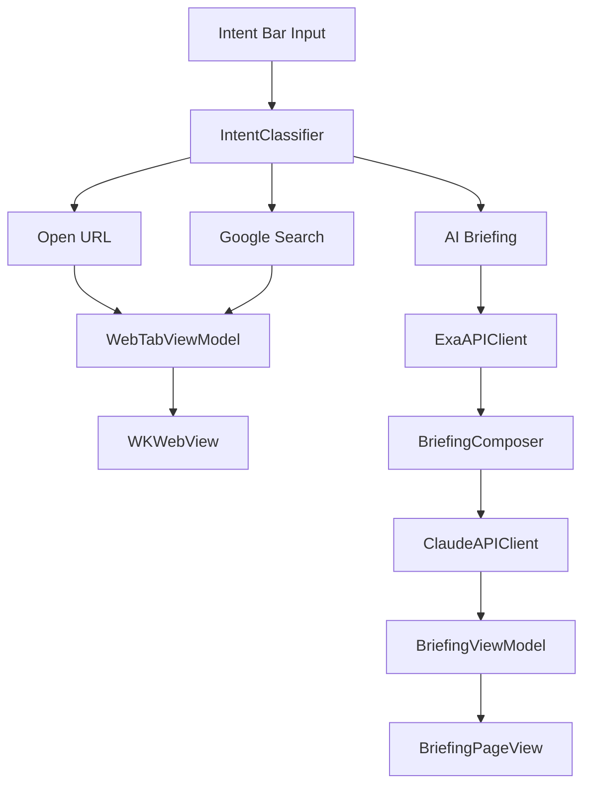
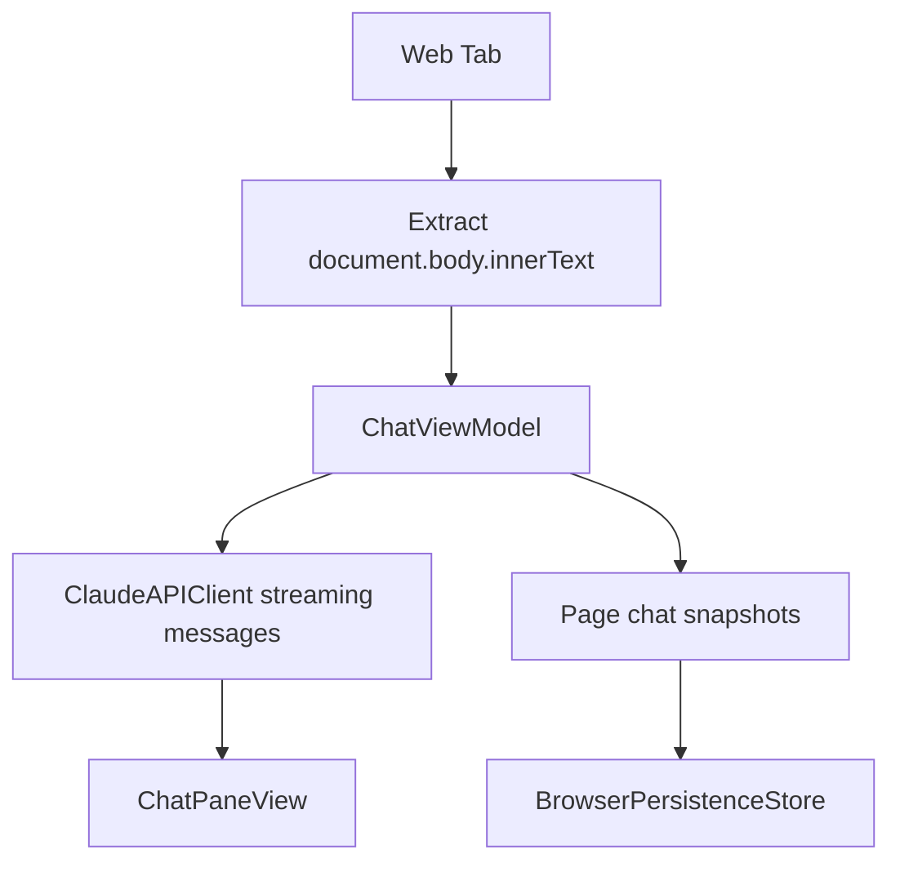

# Browse

Browse is a native macOS browser experiment built with SwiftUI and WebKit. It combines a minimal tabbed browser shell with an intent bar, AI-generated research briefings, page-aware chat, persistent browser sessions, and user-configurable appearance.

The app is organized as a Swift Package executable target named `Browse`. It currently targets macOS 15 and Swift 6.

## Contents

- [Features](#features)
- [Requirements](#requirements)
- [Quick Start](#quick-start)
- [API Keys](#api-keys)
- [Using Browse](#using-browse)
- [Keyboard Shortcuts](#keyboard-shortcuts)
- [Architecture](#architecture)
- [Data, Privacy, and Persistence](#data-privacy-and-persistence)
- [Networking](#networking)
- [Testing](#testing)
- [Project Layout](#project-layout)
- [Development Notes](#development-notes)
- [Troubleshooting](#troubleshooting)

## Features

### Native Browser Shell

- SwiftUI macOS app with a custom hidden-title-bar window.
- WKWebView-backed web tabs.
- Desktop Safari user agent for more consistent desktop page rendering.
- Back, forward, reload, hard reload, stop loading, and progress indication.
- Normal and private browser windows.
- Native traffic-light controls hosted inside the sidebar.
- Multi-window restoration for normal windows.

### Intent Bar

The intent bar is the primary input surface. It accepts URLs, domains, search queries, and natural-language questions.

- Opens explicit `http://` and `https://` URLs.
- Opens domain-like inputs such as `apple.com` or `github.com/user/repo`.
- Opens localhost and IPv4 inputs as web pages.
- Sends question-like or longer natural-language input to AI briefing mode.
- Sends short phrase input to Google Search.
- Supports Shift-Tab to toggle an input between Search and Brief modes.
- Shows intent badges for Open, Brief, and Search.
- Shows suggestions from:
  - Google autocomplete
  - local fallback suggestions
  - recent briefing queries
  - open tabs
  - frequent domains from current tabs

### Tabs and Sidebar

- Vertical sidebar with Arc-style tab organization.
- Sections for Favorites, Pinned, Today, and Earlier.
- Favorite tabs render as icon tiles.
- Pinned tabs render compactly.
- Normal tabs render with title, favicon, close affordance, and hover states.
- Tabs can be dragged to reorder within their current visual section.
- Context menu actions:
  - Close
  - Close Others
  - Close Tabs Below
  - Copy URL
  - Add or remove from Favorites
  - Pin or unpin
  - Duplicate
- Tabs become visually stale after several hours of inactivity unless pinned or favorited.

### AI Briefings

Briefings turn a natural-language question into an editorial research page.

- Exa Search API fetches web sources and page content.
- Claude streams a synthesized briefing from the retrieved sources.
- The app parses streamed Markdown into:
  - headline
  - TL;DR
  - sections
  - source citations
- Source citations use `cite://` links and resolve to the matching source.
- Source shelf shows numbered source cards.
- Image carousel shows source images when Exa returns image URLs.
- Briefing follow-ups continue the same briefing thread.
- Streaming, loading skeletons, retry states, and follow-up auto-scroll are handled in the UI.

### Page Chat

Page chat lets the user ask Claude questions about the currently loaded web page.

- Opens as a right-side pane beside the current web page.
- Extracts up to 12,000 characters from `document.body.innerText`.
- Sends page URL, page title, and extracted content in Claude's system prompt.
- Streams Markdown responses.
- Stores chat history per page in normal browsing.
- Allows clearing chat for the current page.
- Resizable chat pane.

### Settings

The Settings window includes:

- Accent color presets.
- Custom accent color picker.
- Claude API key input and connection test.
- Exa API key input and connection test.
- Links to the Anthropic Console and Exa dashboard.

## Requirements

- macOS 15 or newer.
- Xcode with Swift 6 support.
- Network access for web browsing, search suggestions, favicons, Exa, and Claude.
- API keys for AI features:
  - Anthropic Claude API key
  - Exa API key

The core browser shell can run without API keys, but briefings and page chat require the relevant keys.

## Quick Start

Clone the repository, resolve dependencies, and run the package.

```sh
swift package resolve
swift test
```

For day-to-day app development, open the package in Xcode:

```sh
open Package.swift
```

Then select the `Browse` executable target and run it.

You can also try launching from the command line:

```sh
swift run Browse
```

Xcode is the recommended path for interactive app development because it gives the app a more complete macOS debugging environment.

## API Keys

Open Browse settings and enter:

- Claude API key: used for briefing synthesis, briefing follow-ups, and page chat.
- Exa API key: used for retrieving web sources for briefings.

Keys are stored in the current user's macOS Keychain under:

```text
com.browse.app.api-keys.v2
```

The key accounts are:

```text
claude-api-key
exa-api-key
```

`APIKeyStore` also attempts to migrate legacy entries from the older `com.browse.app` service name.

Keychain reads use an `LAContext` with `interactionNotAllowed = true`. This means Browse does not intentionally trigger macOS password prompts while launching, generating briefings, or chatting. If the Keychain requires user interaction, Browse treats the key as unavailable and asks the user to configure it again.

Do not commit API keys, signing identities, private account IDs, local usernames, certificates, provisioning profile details, machine-specific paths, or private URLs.

## Using Browse

### Opening Pages

Use the intent bar to open:

```text
https://example.com
example.com
github.com/user/repo
localhost:3000
192.168.0.1
```

Explicit URLs with `http` or `https` open directly. Domain-like text gets `https://` added. Localhost and IP inputs get `http://` added.

### Searching

Short phrase input becomes a web search. Browse opens Google Search with the query in the active web tab.

Examples:

```text
swift tutorial
best text editor
weather radar
```

Autocomplete suggestions appear while typing. Browse provides local fallback suggestions immediately and then merges remote Google suggestions when available.

### Creating Briefings

Question-like input becomes an AI briefing.

Examples:

```text
what is passkey adoption like in 2026?
compare SwiftUI and AppKit for native macOS apps
explain how WebKit process isolation works
best restaurants in SF for a date night with vegetarian options
```

The classifier treats inputs as briefings when they:

- end with a question mark
- start with common question or research prefixes such as `what`, `how`, `why`, `explain`, `compare`, or `summarize`
- contain five or more words

Use Shift-Tab in the intent bar to switch a non-URL input between Search and Brief mode before submitting.

### Reading Briefings

A briefing page shows:

- original query
- generated headline
- TL;DR summary
- Markdown sections
- image carousel when source images are available
- source shelf with numbered source cards
- follow-up input

Inline citations such as `[[1]](cite://1)` are resolved to the corresponding source in the source list. Clicking a citation or source opens that source in a new web tab.

### Asking Follow-Ups

After a briefing completes, use the follow-up bar at the bottom of the briefing page. Follow-ups are sent to Claude with the original query and generated briefing as context.

Follow-up answers render as continuation sections below the source shelf. While a follow-up streams, Browse follows the latest answer unless the user scrolls away from the bottom.

### Chatting With a Page

Open a web page, then use Chat with Page from the app command or intent bar button. Browse extracts page text and opens a right-side chat pane.

The chat pane supports:

- page-specific context
- streaming Markdown answers
- auto-scroll to new messages
- per-page history in normal browsing
- clearing chat history for the current page
- width resizing

The chat prompt asks Claude to answer based on the current page. If the user asks about something not present on the page, the prompt instructs Claude to say so.

### Managing Tabs

Use the sidebar to select, close, favorite, pin, duplicate, and reorder tabs.

Favorite tabs appear as tiles at the top. Pinned tabs appear in a compact section. Unpinned tabs are split into Today and Earlier based on the last access time. Tabs that have not been accessed for about four hours begin to fade unless pinned or favorited.

### Private Browsing

Private windows use:

- a non-persistent `WKWebsiteDataStore`
- no browser session persistence
- no recently closed tab memory
- an ephemeral favicon session

API keys still come from the user's Keychain because they are app settings, not browsing history.

## Keyboard Shortcuts

### Window and Tab Commands

| Shortcut | Action |
| --- | --- |
| Cmd-N | New window |
| Cmd-Shift-N | New private window |
| Cmd-T | New tab |
| Cmd-W | Close active tab, or close window when no tab is active |
| Cmd-Shift-T | Reopen closed tab |
| Cmd-1 through Cmd-8 | Select tab by visible sidebar order |
| Cmd-9 | Select last tab by visible sidebar order |
| Cmd-Option-Left | Previous tab |
| Cmd-Option-Right | Next tab |
| Ctrl-Shift-Tab | Previous tab |
| Ctrl-Tab | Next tab |

Tab number shortcuts follow the sidebar's visual grouping order:

1. Favorites
2. Pinned
3. Today
4. Earlier

### Navigation Commands

| Shortcut | Action |
| --- | --- |
| Cmd-R | Reload |
| Cmd-Shift-R | Hard reload from origin |
| Cmd-Left | Back |
| Cmd-Right | Forward |
| Cmd-[ | Back |
| Cmd-] | Forward |

### App Chrome Commands

| Shortcut | Action |
| --- | --- |
| Cmd-L | Focus intent bar |
| Cmd-E | Toggle page chat |
| Cmd-S | Show or hide sidebar |
| Shift-Tab in intent bar | Toggle Search and Brief modes for the current input |
| Up/Down in intent bar | Move through suggestions |
| Return in intent bar | Submit input or selected suggestion |
| Escape in intent bar | Clear highlighted suggestion |

## Architecture

Browse follows a small SwiftUI application architecture:

- Models define serializable browser, briefing, source, tab, and conversation data.
- Services handle API calls, persistence, classification, Keychain storage, favicons, autocomplete, and prompt construction.
- View models coordinate user actions, application state, streaming, page extraction, tab management, and persistence.
- Views render the browser window, intent bar, tab sidebar, web content, briefings, chat, settings, and shared UI.

### High-Level Flow



### Page Chat Flow



### Entry Point and Commands

`BrowseApp.swift` contains:

- `BrowseApp`, the SwiftUI `@main` app.
- `BrowserWindowConfiguration`, which distinguishes normal, private, new, and restored windows.
- `AppDelegate`, which brings Browse to the foreground, configures the hidden title bar, and marks termination for session pruning.
- `BrowserCommands`, which installs menu commands and keyboard shortcuts.

The main scene is a `WindowGroup` keyed by `BrowserWindowConfiguration`. A separate `Settings` scene hosts `SettingsView`.

### Models

| File | Purpose |
| --- | --- |
| `Models/Tab.swift` | Observable tab state, tab kind, pinned/favorite flags, staleness, and decay opacity. |
| `Models/IntentClassification.swift` | Open, Brief, and Search classification result. |
| `Models/BriefingDocument.swift` | Streaming and parsed briefing document state. |
| `Models/Source.swift` | Briefing source metadata, URLs, snippets, favicons, images, author, and publish date. |
| `Models/ConversationMessage.swift` | Codable user and assistant chat or follow-up messages. |

### Services

| File | Purpose |
| --- | --- |
| `Services/APIKeyStore.swift` | Keychain storage, legacy key migration, non-interactive reads, and key caching. |
| `Services/AccentColorManager.swift` | UserDefaults-backed accent color settings. |
| `Services/IntentClassifier.swift` | Rule-based intent classification for URLs, domains, questions, and searches. |
| `Services/SearchAutocompleteService.swift` | Google suggestion request construction and response parsing. |
| `Services/FaviconService.swift` | Favicon URL normalization, Google S2 fallback, direct favicon support, caching, and private-mode fetching. |
| `Services/ExaAPIClient.swift` | Exa search requests and connection checks. |
| `Services/ExaTypes.swift` | Exa request and response types. |
| `Services/ClaudeAPIClient.swift` | Anthropic Messages API requests, streaming response handling, and connection checks. |
| `Services/ClaudeStreamParser.swift` | Server-Sent Events parser for Claude streaming events. |
| `Services/ClaudeTypes.swift` | Claude request, message, and stream payload types. |
| `Services/BriefingComposer.swift` | System prompts and user messages for initial briefings and follow-ups. |
| `Services/BriefingCitationResolver.swift` | Resolves `cite://N` links to source URLs. |
| `Services/BrowserPersistenceStore.swift` | JSON persistence for windows, tabs, briefings, navigation history, chat geometry, and page chats. |
| `Services/BrowserWindowSessionController.swift` | Tracks open windows, restores additional windows, and prunes state on termination. |

### View Models

| File | Purpose |
| --- | --- |
| `ViewModels/BrowserViewModel.swift` | Main coordinator for tabs, windows, intent handling, chat pane state, persistence, and navigation commands. |
| `ViewModels/WebTabViewModel.swift` | WKWebView owner, navigation state, scroll tracking, page content extraction, and navigation history snapshots. |
| `ViewModels/IntentBarViewModel.swift` | Intent bar text, delayed classification, autocomplete, and Search/Brief override mode. |
| `ViewModels/BriefingViewModel.swift` | Exa search, Claude streaming, briefing parsing, phase tracking, and follow-up streaming. |
| `ViewModels/ChatViewModel.swift` | Page-aware chat context, streaming Claude responses, errors, and conversation history. |
| `ViewModels/SettingsViewModel.swift` | API key loading/saving and connection tests. |

### Views

| Directory or File | Purpose |
| --- | --- |
| `Views/BrowserWindow.swift` | Main window layout, sidebar/content composition, new tab page, hover reveal behavior, and window close hooks. |
| `Views/NativeTrafficLightControls.swift` | Rehosts native macOS close/minimize/zoom buttons in the sidebar. |
| `Views/IntentBar/` | Intent input, badge, keyboard handling, suggestions, navigation buttons, and chat toggle. |
| `Views/TabBar/` | Sidebar sections, tab rows, favorite tiles, context menus, and drag reorder behavior. |
| `Views/WebContent/` | WKWebView bridge and loading progress indicator. |
| `Views/Briefing/` | Briefing page, header, sections, source shelf, image carousel, skeleton, follow-up input, and follow-up history. |
| `Views/Chat/` | Page chat pane, message rendering, streaming state, clear confirmation, and resizing. |
| `Views/Settings/` | Appearance and API key settings. |
| `Views/Shared/` | Favicons, type scale, color palette, and shared view modifiers. |

### Extensions

| File | Purpose |
| --- | --- |
| `Extensions/URL+Utilities.swift` | Display strings and stable page chat session keys. |
| `Extensions/Color+Tinting.swift` | Hex color conversion and dominant image color extraction. |
| `Extensions/View+Helpers.swift` | Conditional SwiftUI view modifier helper. |

## Data, Privacy, and Persistence

Browse treats the repository as suitable for public/open-source development. Runtime data stays on the user's machine unless the user explicitly uses network-backed features.

### Stored Locally

| Data | Storage |
| --- | --- |
| Claude and Exa API keys | macOS Keychain, service `com.browse.app.api-keys.v2` |
| Accent color | UserDefaults key `accentColorHex` |
| Normal browser session | JSON under the user's Application Support `Browse` directory |
| Normal web browsing data | Default WebKit website data store |
| Private web browsing data | Non-persistent WebKit website data store |
| Private favicon requests | Ephemeral URLSession |

### Persisted Browser State

Normal windows persist:

- open tabs
- active tab
- tab kind
- tab title and URL
- navigation history snapshot and current history index
- pinned/favorite state
- created and last-accessed timestamps
- briefing document and phase
- briefing follow-up conversation history
- sidebar visibility and width
- chat pane width, height, and offset
- page chat snapshots

Blank new-tab-only windows are not restorable. Closed normal windows are removed from the restore list unless the app is terminating. On termination, Browse prunes stored windows to the currently open normal windows.

Page chat snapshots are keyed by normalized URL. URL fragments are ignored, schemes and hosts are lowercased, and default ports are removed. Browse keeps up to 120 persisted page chat snapshots.

### Private Browsing Behavior

Private windows do not persist browser state, recently closed tabs, page chats, or WebKit website data. They still use configured API keys from Keychain when the user invokes AI features.

### Repository Hygiene

Do not commit:

- API keys or access tokens
- personal emails or private account IDs
- local usernames or machine-specific absolute paths
- signing identities, certificates, or provisioning profile details
- private URLs
- generated build products

The `.gitignore` excludes common local SwiftPM, Xcode, DerivedData, `.DS_Store`, and generated workspace files.

## Networking

Browse uses the network for both browser content and app services.

| Purpose | Endpoint or Service | Code |
| --- | --- | --- |
| Web browsing | User-entered URLs through WKWebView | `WebTabViewModel` |
| Web search | Google Search URL | `BrowserViewModel.openGoogleSearch` |
| Autocomplete | `https://suggestqueries.google.com/complete/search` | `SearchAutocompleteService` |
| Favicons | Direct favicon URL or Google S2 favicon service | `FaviconService` |
| Briefing source search | `https://api.exa.ai/search` | `ExaAPIClient` |
| AI generation and chat | `https://api.anthropic.com/v1/messages` | `ClaudeAPIClient` |

`Info.plist` allows arbitrary loads because this is a browser and must be able to load arbitrary user-entered web destinations.

`Browse.entitlements` contains hardened-runtime settings needed for WebKit and JavaScriptCore behavior, including JIT and library validation allowances.

## Testing

Run the full test suite:

```sh
swift test
```

Run a focused suite:

```sh
swift test --filter IntentClassifier
swift test --filter IntentBarViewModel
swift test --filter BrowserPersistenceStore
```

The project uses the Swift Testing framework (`import Testing`), not XCTest.

Current tests cover:

- URL, domain, localhost, question, and search classification.
- Shift-Tab Search/Brief toggling.
- immediate local autocomplete fallback behavior.
- Google autocomplete request construction and parser cleanup.
- tab shortcut ordering across Favorites, Pinned, Today, and Earlier.
- multi-window persistence, pruning, and blank-window non-restoration.
- favicon request normalization.
- briefing citation resolution.

The existing tests do not perform live Claude, Exa, WebKit page-load, or UI automation calls.

## Project Layout

```text
.
|-- Package.swift
|-- Package.resolved
|-- README.md
|-- Browse.entitlements
|-- Browse/
|   `-- Sources/
|       |-- BrowseApp.swift
|       |-- Extensions/
|       |-- Models/
|       |-- Resources/
|       |   `-- Info.plist
|       |-- Services/
|       |-- ViewModels/
|       `-- Views/
|           |-- Briefing/
|           |-- Chat/
|           |-- IntentBar/
|           |-- Settings/
|           |-- Shared/
|           |-- TabBar/
|           `-- WebContent/
`-- BrowseTests/
```

## Development Notes

### Dependency Management

The package has one direct dependency:

```swift
.package(url: "https://github.com/gonzalezreal/swift-markdown-ui.git", from: "2.4.0")
```

`Package.resolved` currently pins MarkdownUI and its transitive dependencies.

### Adding Browser Features

Browser-wide behavior usually belongs in `BrowserViewModel`. WKWebView-specific behavior belongs in `WebTabViewModel`. Keep tab state mirrored back into `Tab` through the existing `wireWebTabState` path so persistence and sidebar UI stay synchronized.

### Adding Briefing Features

Briefing generation flows through:

1. `BrowserViewModel.openBriefing`
2. `BriefingViewModel.generate`
3. `ExaAPIClient.search`
4. `BriefingComposer`
5. `ClaudeAPIClient.streamMessage`
6. streamed Markdown parsing in `BriefingViewModel`
7. `BriefingPageView`

Citation behavior should stay compatible with `BriefingCitationResolver` and the `[[N]](cite://N)` convention used in `BriefingComposer`.

### Adding Page Chat Features

Page chat flows through:

1. `BrowserViewModel.openChatPane`
2. `BrowserViewModel.updateChatContextIfNeeded`
3. `WebTabViewModel.extractPageContent`
4. `ChatViewModel.sendMessage`
5. `ClaudeAPIClient.streamMessage`
6. `ChatPaneView`

Per-page chat persistence depends on `URL.chatSessionKey`; update tests if that keying behavior changes.

### State Persistence

All persisted browser state should remain Codable and backwards-tolerant where practical. Existing snapshots already use optionals for some fields to support older state files.

Persistence errors are intentionally non-fatal and logged to stdout so a corrupt or unavailable state file does not crash the app.

### Logging

The app prints diagnostic messages for:

- lifecycle and signing state
- Exa search start/failure/count
- Claude request and streaming status
- SSE decoding issues
- persistence failures
- page content extraction failures

Avoid logging secrets, raw API keys, or sensitive full page content.

## Troubleshooting

### Briefings or Chat Say an API Key Is Missing

Open Settings and enter the relevant key. Use Test Connection to verify it. If a key exists in Keychain but macOS requires interaction to access it, Browse treats it as unavailable because non-interactive reads are intentional.

### Briefing Search Fails

Check the Exa API key and network access. The app shows the API error message in the briefing error state and offers Try Again.

### Claude Streaming Fails

Check the Claude API key, model availability, and network access. Model selection is centralized in `ClaudeAPIClient`.

### Autocomplete Does Not Show Remote Suggestions

Browse still shows local fallback suggestions. Remote suggestions require access to `suggestqueries.google.com` and are ignored on failed or non-2xx responses.

### Favicons Do Not Load

Browse falls back to generated letter icons. Favicon requests use direct favicon URLs when likely, otherwise Google S2 by normalized host.

### Pages Render Differently Than Safari

Browse uses WKWebView with a desktop Safari user agent, but embedded WebKit behavior can still differ from Safari. Some sites may also depend on browser features, cookies, permissions, or process behavior not implemented by this app shell.

## Status

Browse is an experimental native macOS browser. It has working tests for core classification, persistence, favicon normalization, autocomplete parsing, and citation resolution, but it is not a hardened general-purpose browser distribution yet.
